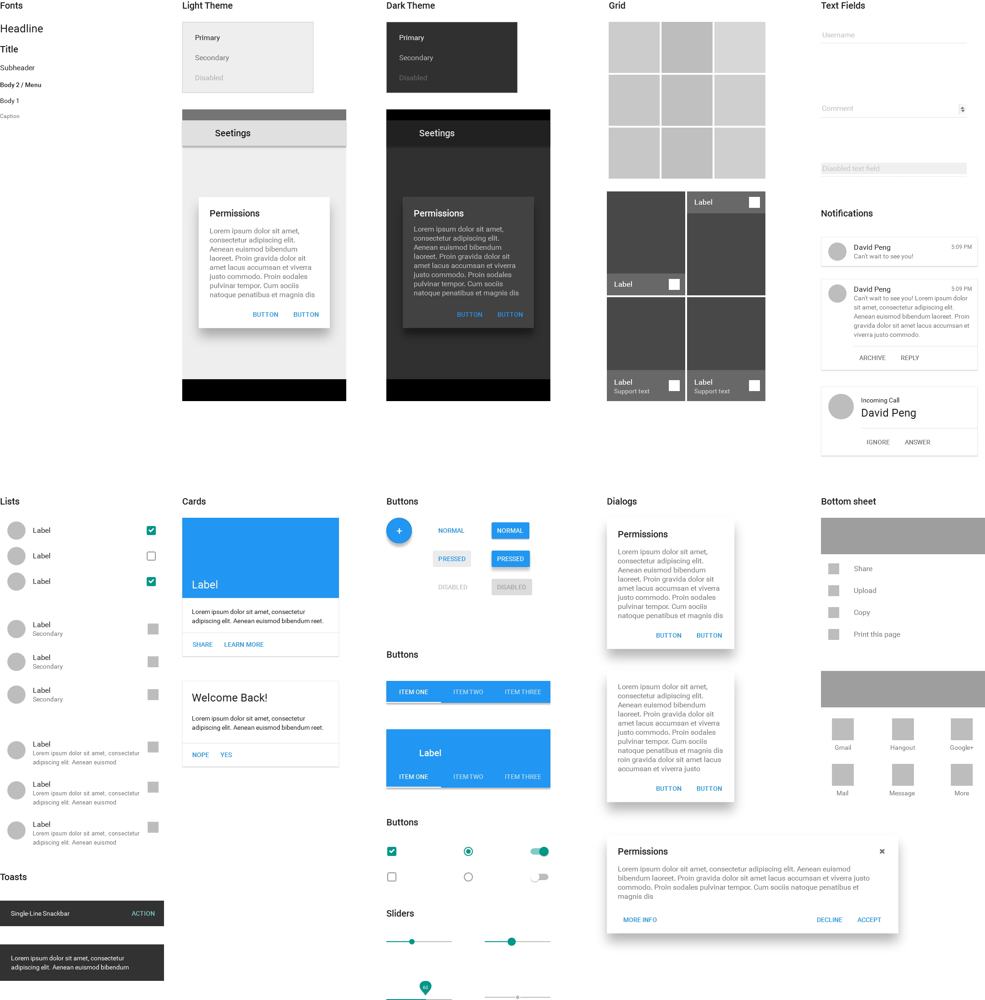

# What is this?

This is an Axure widget library based on Google Material Design.

# Demo

# Version Notes

- Removed FontAwesome font, and use [Google Material Design icons](https://github.com/google/material-design-icons/) instead.
- Add widget: Date Picker and Context Menu.
- Add widget library for Axure 8.

# How to use it?

1. You should install Roboto, because I use Roboto as the main font.
2. Download the Axure library file:
    - [Axure 7 version](https://github.com/duzyn/material-axure-library/blob/master/material-design-7.rplib?raw=true)
    - [Axure 8 version](https://github.com/duzyn/material-axure-library/blob/master/material-design-8.rplib?raw=true)
3. Open your Axure, click the three bars icon and choose "Load Library". Find the library file to Load it.
4. That's all! You can now enjoy your time for making some Material Design prototypes.

# To do

- Thumbnails. I'm not good at icon making if you can fork my repo and contribute to it, I will appreciate it.
- Chinese version. I'm a Chinese, the Noto Sans CJK SC is the recommened CJK font used in Android.

# Author

I'm David Peng. A product manager in Shenzhen, China. You can find me on [@davidduzyn](http://twitter.com/davidduzyn) or [my blog](http://www.pengdaiwu.com).
